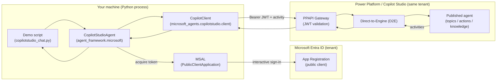
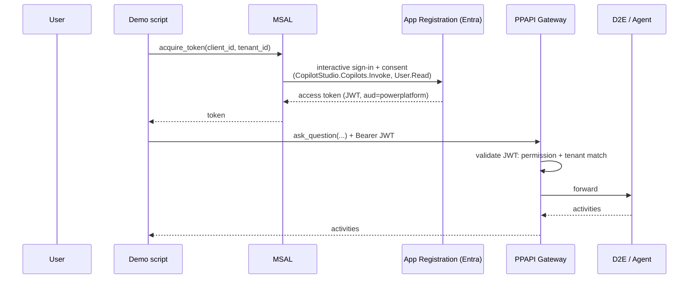

# Architecture & Design — Invoking Copilot Studio Agents from the Microsoft Agent Framework

This document explains how the demo is put together: the moving parts, how a
message flows from your Python process to a published Copilot Studio agent and
back, the authentication model, and the design principles that guided the
implementation. It also captures the real-world constraints we hit while getting
it working, so the next person doesn't have to rediscover them.

## 1. Purpose

Show, in the smallest possible code, how the **Microsoft Agent Framework** (MAF)
can invoke a **Microsoft Copilot Studio** agent as a first-class agent — i.e.
call `agent.run(...)` and get a response, with multi-turn conversation state.

## 2. Component overview

| Layer | Responsibility |
|-------|----------------|
| **Demo script** | REPL loop, reads `.env`, owns the conversation session, prints replies. |
| **`CopilotStudioAgent`** (MAF) | MAF-shaped wrapper. Resolves settings, acquires a token (or accepts one), creates the client, maps Copilot Studio *activities* ↔ MAF *messages*. |
| **`CopilotClient`** (Agents SDK) | Low-level Direct-to-Engine client: starts conversations, sends questions, streams activities over HTTP. |
| **MSAL** | Acquires the Entra access token for the Power Platform API scope. |
| **App Registration** | The Entra identity the user signs into; carries the API permissions. |
| **PPAPI Gateway → D2E → Agent** | Validate the JWT, route to the engine, run the published agent. |

## 3. Request lifecycle (one turn)

1. The script calls `agent.run(user_input, session=session)`.
2. On the first turn, `CopilotStudioAgent` acquires a token via MSAL
   (`acquire_token` → `PublicClientApplication.acquire_token_interactive`) for
   scope `https://api.powerplatform.com/.default`. A browser opens for sign-in.
3. `CopilotClient` starts a conversation (if the session has no
   `service_session_id` yet) and then sends the question to **Direct-to-Engine**.
4. The **PPAPI gateway** validates the Entra JWT (permission + tenant match +
   agent share ACL) and forwards to the engine.
5. The published agent runs and emits **activities**.
6. `CopilotStudioAgent._process_activities` converts activities into MAF
   `Message` objects; the script prints `result.text`.

## 4. Authentication & authorization model

Authentication is **Entra-only** (AAD JWT) — there is no DirectLine secret. The
demo uses the **user-delegated (interactive)** flow.

### The non-negotiable constraint: same tenant

Copilot Studio Direct-to-Engine enforces, at runtime, that **the caller's tenant
matches the agent's tenant**. Therefore:

- The **App Registration must live in the same Entra tenant as the agent.**
- Multi-tenant app registrations, B2B guests, and cross-tenant tokens do **not**
  work — the gateway returns `D2EAccessDenied`.
- Your Azure *subscription* tenant is irrelevant; only the Entra tenant of the
  app registration and the signed-in user matter.

### What the App Registration must have

- **Type:** Public client / native (mobile & desktop).
- **Redirect URI:** `http://localhost` (HTTP, not HTTPS).
- **Allow public client flows:** enabled.
- **Delegated API permissions:**
  - Power Platform API → `CopilotStudio.Copilots.Invoke`
  - Microsoft Graph → `User.Read`
- **Consent:** granted (admin consent, or user consent at first sign-in).

> Do **not** use the agent's own app/identity ID as the login client ID. That is
> an *agent blueprint / agent identity*, which Entra blocks from interactive
> flows (`AADSTS82018: Response types other than none are not allowed for agent
> blueprints and agent Identities`). Bring your own login app registration.

## 5. Configuration

All configuration is via environment variables (loaded from `.env` by
`python-dotenv`), matching the SDK's `COPILOTSTUDIOAGENT__` prefix:

| Variable | Meaning |
|----------|---------|
| `COPILOTSTUDIOAGENT__ENVIRONMENTID` | Power Platform environment that hosts the agent. |
| `COPILOTSTUDIOAGENT__SCHEMANAME` | The agent's schema name (its identifier). |
| `COPILOTSTUDIOAGENT__AGENTAPPID` | Client ID of the login app registration. |
| `COPILOTSTUDIOAGENT__TENANTID` | Tenant of the app registration **and** the agent. |

**Design principle — configuration, not code.** Nothing tenant- or
agent-specific is hard-coded. Pointing the demo at a different agent is a `.env`
change, never a code change.

## 6. Conversation state

`CopilotStudioAgent` is stateless per call; conversation continuity is carried by
an **`AgentSession`**:

- The script creates one session (`agent.create_session()`) and passes it to
  every `run(...)`, so the agent remembers earlier turns.
- On the first call, the provider starts a D2E conversation and stores the
  `service_session_id` on the session.
- `reset` simply creates a new session (new conversation); `exit` ends the loop.

## 7. Streaming vs. non-streaming (an important behavior)

The provider maps activities to messages differently per mode:

- **Streaming** yields text only from `typing` activities (incremental tokens).
- **Non-streaming** yields text from the final `message` activity.

Classic / non-generative Copilot Studio agents emit only a final `message`
activity, so **streaming returns no text for them**. The demo therefore uses
**non-streaming** `run(...)` for reliability across agent types. (Generative
agents that emit `typing` activities can use streaming.)

## 8. Design principles

1. **Smallest faithful example.** Match the official provider sample; avoid
   frameworks or abstractions that obscure the core `run(...)` call.
2. **Configuration over code.** Tenant/agent details live in `.env`; the code is
   agent-agnostic.
3. **Fail where the boundary is.** Validation and errors surface at the real
   boundary (auth, D2E) rather than being pre-guessed in code.
4. **Secrets stay out of the repo.** `.env` and the token cache are git-ignored;
   the interactive flow needs no client secret at all.
5. **Least privilege.** Only `CopilotStudio.Copilots.Invoke` and `User.Read`
   delegated permissions — nothing broader.
6. **Match the platform's constraints, don't fight them.** Same-tenant is
   enforced by design, so the solution embraces it instead of attempting
   cross-tenant workarounds.

## 9. Failure modes we hit (and the fix)

| Symptom | Cause | Fix |
|---------|-------|-----|
| `AADSTS82018` (agent blueprints) | Used the agent's own identity as the login client ID | Use a real public-client app registration |
| `AADSTS650057` (invalid resource) | App registration missing the Power Platform API permission | Add delegated `CopilotStudio.Copilots.Invoke` |
| `AADSTS500113` (no reply address) | No redirect URI on the app | Add `http://localhost`, enable public client flows |
| `access_denied` | Consent screen cancelled / user consent disabled | Complete consent, or grant admin consent |
| `AttributeError: get_new_thread` | Older API name | Use `create_session()` / `session=` |
| Empty agent reply | Streaming yields nothing for classic agents | Use non-streaming `run(...)` |
| `LatestPublishedVersionNotFound` | Agent not published | Publish the agent in Copilot Studio |
| `D2EAccessDenied` | Caller tenant ≠ agent tenant | Register the app in the agent's tenant |

## 10. Security considerations

- **Entra-only auth**, user-delegated — the agent runs with the signed-in user's
  identity and access.
- **No stored secrets** in the interactive flow; MSAL holds the token in memory
  for the process lifetime.
- **`.env` and token cache are git-ignored** to prevent credential leakage.
- **Tenant isolation** is enforced by the platform, not just by convention.

## 11. Extending the demo

- **Non-interactive / service-to-service:** swap the interactive token for an
  app-only (client-credentials) or federated-credential token and pass it via the
  `token=` parameter. (Requires the agent to allow the relevant auth mode and the
  app to be shared with the agent.)
- **Orchestration:** wrap `CopilotStudioAgent` as a tool/participant inside a
  larger MAF workflow to combine it with other agents.
- **Streaming UX:** for generative agents, re-enable streaming to render tokens
  as they arrive.

## References

- [Microsoft Agent Framework (Python)](https://github.com/microsoft/agent-framework/tree/main/python)
- [Copilot Studio provider samples](https://github.com/microsoft/agent-framework/tree/main/python/samples/02-agents/providers/copilotstudio)
- [Copilot Studio Client (Direct-to-Engine) sample](https://github.com/microsoft/Agents/tree/main/samples/python/copilotstudio-client)
