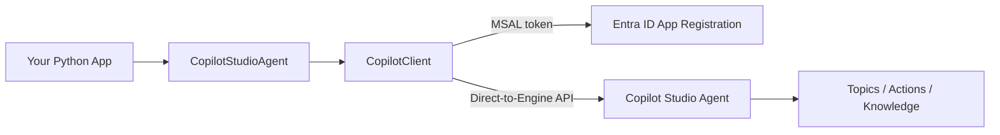

# Invoking Microsoft Copilot Studio Agents from the Microsoft Agent Framework

This demo shows how to call a **Microsoft Copilot Studio** agent from the
**Microsoft Agent Framework** (Python). It walks from the simplest possible call
all the way to an interactive chat loop, so you can showcase the integration end
to end.

The `CopilotStudioAgent` class lets your Agent Framework code treat a published
Copilot Studio agent as a first-class agent: you call `agent.run(...)` and get a
response back, with support for both non-streaming and streaming output.

## What's in this demo

| File | What it demonstrates |
|------|----------------------|
| [`copilotstudio_basic.py`](copilotstudio_basic.py) | The simplest path — create an agent from environment variables and get non-streaming **and** streaming responses. |
| [`copilotstudio_chat.py`](copilotstudio_chat.py) | An interactive **chat REPL** in your terminal — the best thing to demo live. |
| [`copilotstudio_explicit_settings.py`](copilotstudio_explicit_settings.py) | Production-style **explicit configuration** — manual token acquisition and custom `ConnectionSettings`. |
| [`app.py`](app.py) | A polished **Streamlit web chat** with a live config sidebar, per-response latency, and an "API & backend call" panel showing exactly how the UI reaches the agent. |

See [`ARCHITECTURE.md`](ARCHITECTURE.md) for the design, the auth model, and the
end-to-end request flow.

## Architecture



## Prerequisites

1. **A published Copilot Studio agent.** Build and publish an agent in
   [Microsoft Copilot Studio](https://copilotstudio.microsoft.com/).
2. **A Public client / native Entra ID App Registration, created in the SAME
   tenant as the agent.** This is a hard requirement: the Copilot Studio
   Direct-to-Engine runtime validates that the caller's tenant matches the
   agent's tenant, so cross-tenant (even multi-tenant) app registrations are not
   supported. Configure the app with:
   - **Supported account types:** Accounts in this organizational directory only
     (single tenant).
   - **Platform:** Public client/native (mobile & desktop), **Redirect URI:**
     `http://localhost` (HTTP, not HTTPS).
   - **API permissions (delegated):**
     - **Power Platform API** → `CopilotStudio.Copilots.Invoke`
     - **Microsoft Graph** → `User.Read`
   - **Admin consent:** optional for the interactive (user-delegated) flow — you
     consent for yourself at first sign-in. Granting admin consent just skips the
     per-user prompt.

   > Do **not** use the agent's own app/identity ID here. That is an agent
   > blueprint/identity and Entra blocks it from interactive sign-in
   > (`AADSTS82018: Response types other than none are not allowed for agent
   > blueprints and agent Identities`). Use your own login app registration.
3. **Python 3.10+**.

### Where to find the values you need

| Environment variable | Where to find it |
|----------------------|------------------|
| `COPILOTSTUDIOAGENT__ENVIRONMENTID` | Copilot Studio → **Settings** → **Advanced** → Metadata → *Environment ID*. |
| `COPILOTSTUDIOAGENT__SCHEMANAME` | Copilot Studio → your agent → **Settings** → **Advanced** → Metadata → *Schema name*. |
| `COPILOTSTUDIOAGENT__AGENTAPPID` | Entra ID (agent's tenant) → App registrations → *your login app* → *Application (client) ID*. |
| `COPILOTSTUDIOAGENT__TENANTID` | The tenant that hosts the agent (same as the app registration's *Directory (tenant) ID*). |

## Setup

```powershell
# 1. Create and activate a virtual environment
python -m venv .venv
.\.venv\Scripts\Activate.ps1

# 2. Install dependencies
pip install -r requirements.txt

# 3. Configure your credentials
Copy-Item .env.example .env
# ...then edit .env and fill in the four values
```

## Run the demos

Activate the virtual environment first (`.\.venv\Scripts\Activate.ps1` on
Windows PowerShell), then:

```powershell
# Simplest: non-streaming + streaming
python copilotstudio_basic.py

# Interactive chat in the terminal (great for a live demo)
python copilotstudio_chat.py

# Production-style explicit configuration
python copilotstudio_explicit_settings.py
```

### Web demo (Streamlit)

```powershell
python -m streamlit run app.py
```

This opens the chat UI at **http://localhost:8501**. Click an example prompt or
type a question; expand the **"API & backend call"** panel to show the customer
the exact Agent Framework call and the underlying Copilot Studio HTTP request.
Stop the server with `Ctrl+C` in the terminal.

The **first** message in any demo triggers an interactive Entra sign-in (a
browser opens). The token is held in memory for the life of the process, so you
sign in once per run.

## Troubleshooting

- **Authentication errors** — confirm the App Registration has the Power Platform
  API permission, that *Allow public client flows* is enabled, and that all four
  environment variables are correct.
- **Environment / agent not found** — verify the Environment ID and Schema name,
  and make sure the agent is **published**.
- **Interactive sign-in doesn't appear** — corporate proxies/firewalls can block
  the flow; try again on an unrestricted network. Because the token is not
  persisted to disk, each run performs a fresh sign-in (SSO usually makes this
  instant after the first time).

## References

- [Microsoft Agent Framework (Python)](https://github.com/microsoft/agent-framework/tree/main/python)
- [Copilot Studio provider samples](https://github.com/microsoft/agent-framework/tree/main/python/samples/02-agents/providers/copilotstudio)
